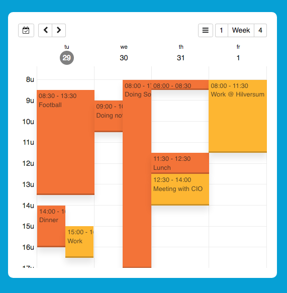

# vue-responsive-calendar

> A responsive calendar with Vue

I was looking for a responsive calendar but couldn't find one that fit my needs. That's why I 
created this. A responsive calendar written in ES6 using Vue.



TODO:

* Multi-language support
* Improve design
* Increasing performance even more
* More samples
* Documentation 

## Usage

~~~.html
<div id="app">

    <responsive-calendar max-size="l" :events="events"></responsive-calendar>

</div>

<script src="/dist/calendar.min.js"></script>

<script>
var today = new Date();

const app = new Vue({

  el: '#app',
  data: {
    events: [{
        dateStart: new Date(today.getTime() + (21.5 * 60 * 60 * 1000)),
        dateEnd: new Date(today.getTime() + (22.5 * 60 * 60 * 1000)),
        styleClass: 'optional css class',
        summary: 'Here a summary',
        description: 'The description',
        location: 'Location'
      }
    ]

  }
});
</script>
~~~

## Features

* Responsive
* Show full week, 4 days, or 1 day per page.
* Prevents events from overlapping
* Jump to today

## Build Setup

``` bash
# install dependencies
npm install

# build for production with minification
npm run build
```

